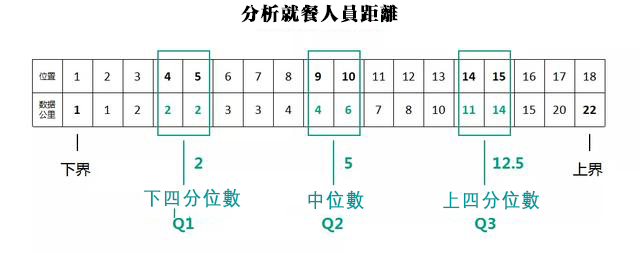
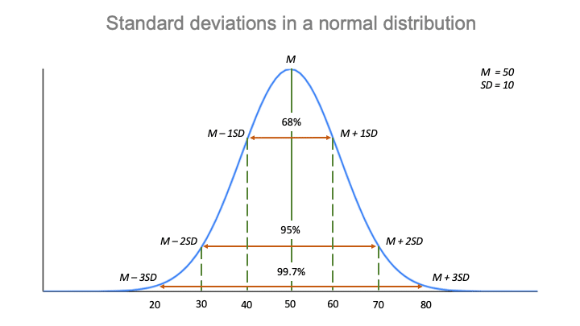
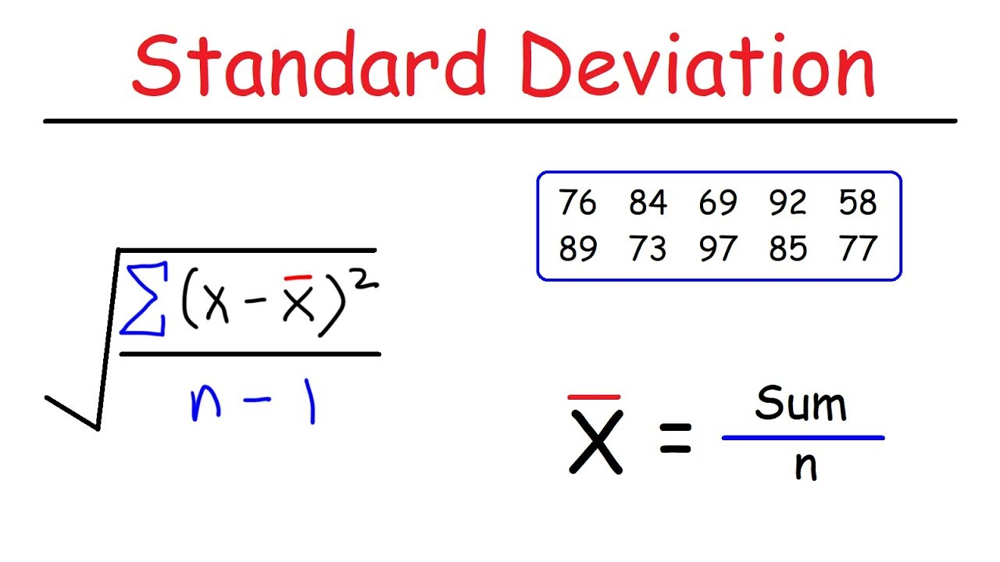
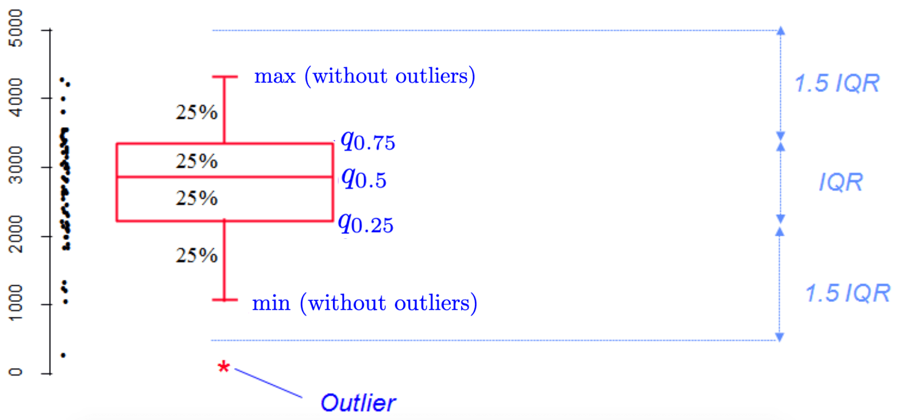

## Intor

-   descriptive statistics is a branch of statistics aiming at summarizing, describing and presenting a series of values or a dataset.
-   Descriptive statistics is often the first step and an important part in any statistical analysis.
-   check the quality of the data and it helps to "understand" the data

## Reference

-   <https://statsandr.com/blog/descriptive-statistics-in-r/>

## Data

```{r}
dat <- iris # load the iris dataset and renamed it dat
```

```{r}
head(dat) # first 6 observations
```

**Questions:** where to check the structure of the data?

## Summary of Data

```{r}
summary(dat)
```

```{r}
by(dat, dat$Species, summary) #descriptive statistics by group use the
```

### Mean and Median

```{r}
mean(dat$Sepal.Length)
mean(dat$Sepal.Length, na.rm = TRUE) #if missing value in your dataset
mean(dat$Sepal.Length, trim = 0.10) # truncated mean
```

```{r}
median(dat$Sepal.Length)
quantile(dat$Sepal.Length, 0.5) #quantile of order 0.5 corresponds to the median.
```

### Quartile

Quartile: 四分位數 \#

```{r}
quantile(dat$Sepal.Length, 0.25) # first quartile
quantile(dat$Sepal.Length, 0.75) # third quartile
```

## Standard deviation and variance

\# \#

```{r}
sd(dat$Sepal.Length) # standard deviation
var(dat$Sepal.Length) # variance
```

```{r}
# Compute the sd (or var) of multiple variables at the same time
lapply(dat[, 1:4], sd)

```

## Get more descriptive statistics (at once)

```{r}
# install.packages("pastecs")
library(pastecs)
stat.desc(dat, norm = TRUE)
```

**Questions:** Why NA for Species?

## Categorical Data

### Count

```{r}
table(dat$Species)
```

### Contingency table

```{r}
dat$size <- ifelse(dat$Sepal.Length < median(dat$Sepal.Length), "small", "big")
```

```{r}
table(dat$size)
table(dat$Species, dat$size) # table of two categorical variables
```

## Plots

### Histogram

```{r}
hist(dat$Sepal.Length)
```

### Scatterplot

```{r}
plot(dat$Sepal.Length, dat$Petal.Length)
```

### Boxplot

\#

-   Very useful!
-   represents the distribution of a quantitative variable by visually displaying five common location summary
-   outlier using the interquartile range (IQR) criterion.

```{r}
boxplot(dat$Sepal.Length ~ dat$Species)
```
