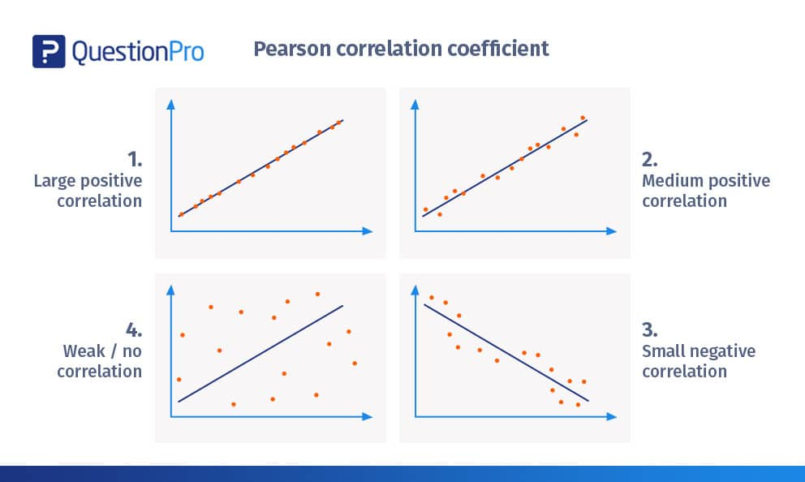

## Correlation



## Correlation in R

- Pearson's correlation coefficient between two continuous variables can be estimated using the `cor()`
- Use `trees` data set
- Goal: determine the correlation coefficient of the association between tree `Height` and `Volume`

## Import and Summary Dataset

To access this in-built dataset we can use the `data()` function

```{r}


```

## Compute Correlation (1/4)

```{r}
# correlation between height and volume


# plot scatter plot

```

## Compute Correlation (2/4)

```{r}
# produce a matrix of correlation coefficients for all variables 


# plot the scatter plot for the pairs that have the most positive correlation


```

## Compute Correlation (3/4)

```{r}
# if missing value in data set, 


```

## Compute Correlation (4/4)

Some important things to remember when using correlation

- correlation coefficient assumes that associations are **linear**
- should be used when using `cor()` on data frames with numerous variables

## Whether the correlation is significant? (1/2)

- We need to test whether the coefficient is significantly different from zero
- Namely, whether this value of correlation valid or not?

## Whether the correlation is significant? (2/2)

- If p \< 0.05, reject null hypothesis and accept alternative hypothesis (more introduction in W6)

```{r}


```

## Chi Square

- Use to analyze the **count data**
- prepare the Chi-square contingency table
- use iris (鳶尾花) data as example

## Import Dataset

```{r}


```

## Prepare Contingency Table

- Try to do it by yourself.
- The contingency table of Species and size

```{r}

# table of two categorical variables
# print the table
```

## Use Chi-square Test

- Test whether the number of species is **independent** of the size using the `chisq.test()`
- p-value \< .05: size is dependent on species.

```{r}

```

## Reference

[An Introduction to R](https://intro2r.com/index.html) Alex Douglas, Deon Roos, Francesca Mancini, Ana Couto & David Lusseau
