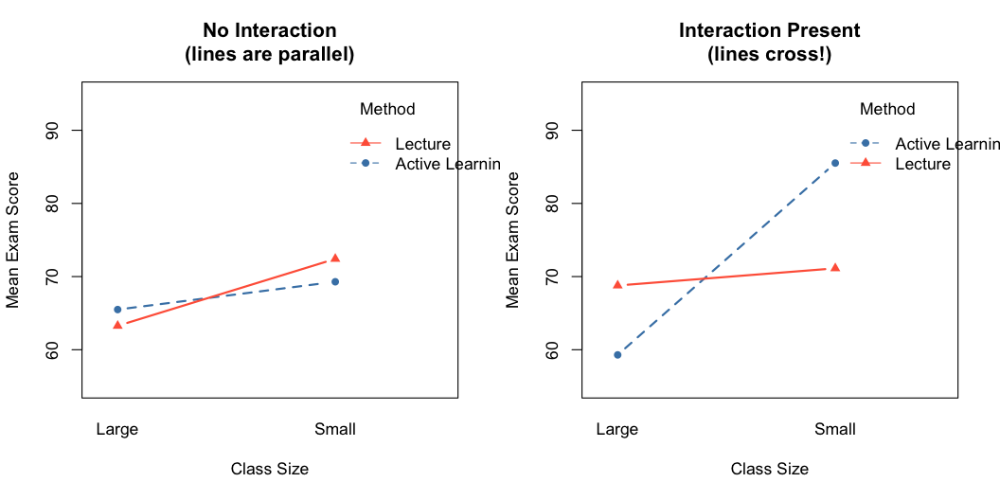

## Introduction 
In this tutorial, we will cover the following topics:

* 1. P-Values
* 2. T-Tests
* 3. ANOVA
* 4. Interaction

## 1. P-Values (1/2)
- A p-value is a probability that measures the evidence against a null hypothesis. 
- The smaller the p-value, the stronger the evidence to reject the null hypothesis. 

## 1. P-Values (2/2)
- In most cases, a p-value threshold of 0.05 is used, meaning if the p-value is less than 0.05, we reject the null hypothesis (and accept the alternative hypothesis).
- Remember to check the null and alternative hypothesis of the statistical test

## 2. T-Tests
T-tests are used to compare the means of two groups or samples. There are two main types of t-tests:

- Independent two-sample t-test
- Paired t-test

## 2.1 Independent two-sample t-test (1/2)
An independent two-sample t-test is used to test whether the means of two independent populations are significantly different.

```{r}
# Generate sample data
set.seed(123)
group1 <- rnorm(30, mean = 5, sd = 1)
group2 <- rnorm(30, mean = 4.5, sd = 1)
```

## 2.1 Independent two-sample t-test (2/2)

```{r}
# Independent two-sample t-test

# Print results

```

## 2.1 Independent two-sample t-test (2/2)
- p value is larger than 0.05
- fail to reject null hypothesis
- group1 and group2 are not significantly different

## 2.1 Independent two-sample t-test: Plots

```{r}
library(gplots)
g1 <- data.frame(group = " ",
                 value = group1)
g2 <- data.frame(group = " ",
                 value = group2)
groups <- 

plotmeans(groups$value ~ groups$group, mean.labels = T, ci.label = T, ylim = c(4, 6))
```


## 2.2 Paired t-test (1/2)
- A paired t-test is used to test whether the means of two dependent populations are significantly different. 
- Used when comparing the means of the same individuals under different conditions.

```{r}
# Generate sample data
set.seed(123)
before <- rnorm(30, mean = 5, sd = 1)
after <- before + rnorm(30, mean = -0.5, sd = 0.5)
```


## 2.2 Paired t-test (2/2)

```{r}
# Paired t-test
t_test <- 

# Print results
print(t_test)

```

## 2.2 Paired t-test: Plots 

```{r}
#library(gplots)
be <- data.frame(group = " ",
                 value = before)
af <- data.frame(group = " ",
                 value = after)
group_be_af <- 

plotmeans(group_be_af$value ~ group_be_af$group, mean.labels = T, ci.label = T, ylim = c(4, 6))
```


## One-way ANOVA

- ANOVA is used to compare the means of three or more groups or samples. 
- It tests whether there is a significant difference between the means of the groups.

```{r}
# Load necessary library
library(dplyr)

# Generate sample data
set.seed(123)
group1 <- rnorm(30, mean = 5, sd = 1)
group2 <- rnorm(30, mean = 4.5, sd = 1)
group3 <- rnorm(30, mean = 6, sd = 1)

# Create data frame
data <- data.frame(
  value = c(group1, group2, group3),
  group = factor(rep(c("Group 1", "Group 2", "Group 3"), each = 30))
)

```

## Assumptions

- [ ] ID: categorical variable (factor); DV: continuous variable (measures)
- [ ] Test for normal distribution
- [ ] Test for variance homogeneity

** really depend on the convention of the research field **

## Assumptions

```{r}
# Test Normality by drawing QQ plot

```


## Run one-way ANOVA

Are the values between groups really different?

```{r}
library(gplots)

```


## Run one-way ANOVA
Multiple ways to run ANOVA

```{r}
# Run ANOVA

# Print ANOVA results

```

## Run one-way ANOVA

```{r}

```

## Report of one-way ANOVA

```{r}
oneway.test(data$value ~ data$group, var.equal = T)
```

## F 

- Ratio of variance between groups over the variance within the groups 
- F-values below 1 are a strong indicator that there is no difference between the groups.

## Numerator and Denominator degrees of freedom

- num df: the number of categories that are compared (df = 2 => 3 categories/groups - 1)
- denom df: the number of observations (df = 87 => 90 - 3 categories)

## Report result of one-way ANOVA

- ``F(num df, denom df) = F Value, p-value``
- ``F( , ) = , p `` (finish your report here)


## Post-Hoc Test

- As a next step, you may want to learn about post-hoc tests for ANOVA, 
- Used to identify specific group differences when the overall ANOVA result is significant. 
- One commonly used post-hoc test is the Tukey HSD (Honest Significant Difference) test.

## Post-Hoc Test

```{r}
# Perform Tukey HSD test

# Print Tukey HSD results

```

## Post-Hoc Test

- There are other post-hoc tests you can explore, 
- such as the Bonferroni test and the Scheffe test. 
- Each test has its assumptions and properties.
- Choose the one that best fits your data and research question.


## Two-Way ANOVA

- A two-way ANOVA is used to examine the effects of two categorical factors on a continuous dependent variable. 
- It allows us to test for the main effects of each factor and their interaction effect.


## Example: Two-Way ANOVA in R
- A dataset of students' scores with two factors: teaching method (A, B, C) and gender (male, female). 
- Examine the effects of teaching method, gender, and their interaction on test scores.
```{r}
# Load necessary libraries
library(dplyr)

# Generate sample data
set.seed(123)
n <- 30

data_twoWay <- expand.grid(method = as.factor(rep(c("A", "B", "C"), n * 2)),
                    gender = as.factor(rep(c("male", "female"), n * 3)))

data_twoWay$score <- rnorm(n * 2 * 3, mean = rep(c(75, 80, 85), each = n * 2), sd = 5)
```

## Example: Two-Way ANOVA in R

```{r}
# Run two-way ANOVA
two_way_anova <- aov(, data = )

# Print ANOVA results
summary(two_way_anova)

```

## Example: Two-Way ANOVA in R (Post-Hoc Test)

```{r}
# Perform Tukey HSD test

# Print Tukey HSD results

```

## Example: Two-Way ANOVA in R (Plotmeans)

```{r}
#library(gplots)
plotmeans(data_twoWay$score ~ interaction(, ))
```


## Interaction Effects
- Interaction effects occur when the effect of one factor depends on the level of another factor
- In a two-way ANOVA, an interaction effect is present if the relationship between the dependent variables 
- One factor changes depending on the level of the other factor

## Example: Interaction Effects

We examine how **exam scores** are affected by two factors:

| Factor | Levels |
|--------|--------|
| Teaching Method (Factor A) | Lecture, Active Learning |
| Class Size (Factor B) | Small, Large |

**Research question:** Does the effect of teaching method on exam scores depend on class size?


## Create the Data

Create two datasets: one **without** an interaction effect and one **with** an interaction effect.

```{r}
#| label: data-setup

set.seed(42)
n <- 15  # students per group (4 groups total)

#| label: data-no-interaction

scores_no_int <- c(
  rnorm(n, mean = 70, sd = 5),   # Lecture       + Small
  rnorm(n, mean = 65, sd = 5),   # Lecture       + Large
  rnorm(n, mean = 71, sd = 5),   # Active Learn  + Small
  rnorm(n, mean = 65, sd = 5)    # Active Learn  + Large
)

method     <- factor(rep(c("Lecture", "Active Learning"), each = n * 2))
class_size <- factor(rep(rep(c("Small", "Large"), each = n), times = 2))

df_no_int <- data.frame(
  score      = scores_no_int,
  method     = method,
  class_size = class_size
)

#| label: data-with-interaction

scores_int <- c(
  rnorm(n, mean = 70, sd = 5),   # Lecture       + Small
  rnorm(n, mean = 68, sd = 5),   # Lecture       + Large
  rnorm(n, mean = 85, sd = 5),   # Active Learn  + Small
  rnorm(n, mean = 60, sd = 5)    # Active Learn  + Large
)

df_int <- data.frame(
  score      = scores_int,
  method     = method,
  class_size = class_size
)
```

## Run Two-Way ANOVA

We use the `*` operator to fit both main effects **and** the interaction term.

```r
# y ~ A * B  is equivalent to  y ~ A + B + A:B
```

## Model 1 — No Interaction Data

```{r}

```

## Model 2 — With Interaction Data

```{r}

```

## Interaction Plots

The interaction plot is the most intuitive way to see whether an interaction exists.

```{r}
par(mfrow = c(1, 2))

# --- Plot 1: No Interaction ---
interaction.plot(
  x.factor     = df_no_int$class_size,
  trace.factor = df_no_int$method,
  response     = df_no_int$score,
  type         = "b",
  col          = c("steelblue", "tomato"),
  pch          = c(16, 17),
  lwd          = 2,
  ylim         = c(55, 95),
  main         = "No Interaction\n(lines are parallel)",
  xlab         = "Class Size",
  ylab         = "Mean Exam Score",
  trace.label  = "Method"
)

# --- Plot 2: With Interaction ---
interaction.plot(
  x.factor     = df_int$class_size,
  trace.factor = df_int$method,
  response     = df_int$score,
  type         = "b",
  col          = c("steelblue", "tomato"),
  pch          = c(16, 17),
  lwd          = 2,
  ylim         = c(55, 95),
  main         = "Interaction Present\n(lines cross!)",
  xlab         = "Class Size",
  ylab         = "Mean Exam Score",
  trace.label  = "Method"
)

par(mfrow = c(1, 1))
```


## Interaction Plots


## Interaction Effects
